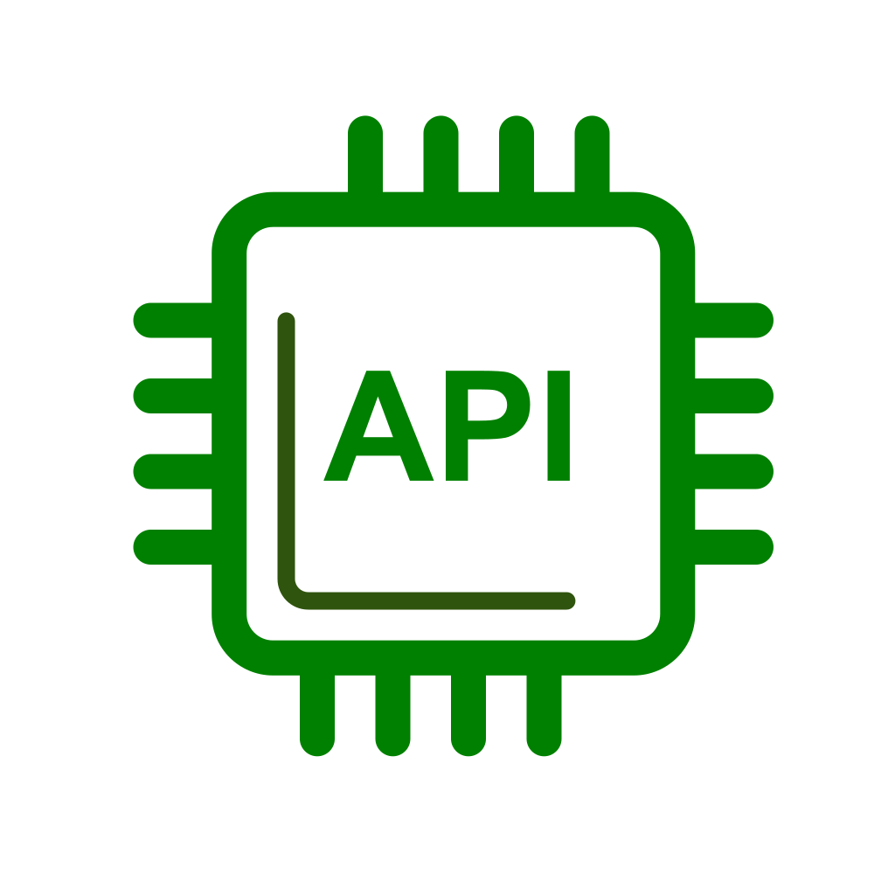

<h1 align="center" style="font-style: italic;">
  
  API Serial
</h1>

Bem-vindo à <strong style="font-style: italic;" >API Serial</strong>, uma interface RESTful desenvolvida para gerenciar usuários, filmes, séries e as interações sociais entre eles. Esta API possibilita o cadastro de usuários, a adição de filmes e séries às listas de favoritos e o registro de interações sociais, como comentários e avaliações. Abaixo estão os principais detalhes sobre o uso e implementação da API.

 

  <a href="#projeto">Projeto</a>&nbsp;&nbsp;&nbsp;|&nbsp;&nbsp;&nbsp;
  <a href="#tabelas">Tabelas</a>&nbsp;&nbsp;&nbsp;|&nbsp;&nbsp;&nbsp;
  <a href="#funcionalidades">Funcionalidades</a>&nbsp;&nbsp;&nbsp;|&nbsp;&nbsp;&nbsp;
  <a href="#tecnologias">Tecnologias</a>&nbsp;&nbsp;&nbsp;|&nbsp;&nbsp;&nbsp;
  <a href="#como-usar">Como Usar</a>&nbsp;&nbsp;&nbsp;|&nbsp;&nbsp;&nbsp;
  <a href="#usuarios">Usuários</a>&nbsp;&nbsp;&nbsp;|&nbsp;&nbsp;&nbsp;
  <a href="#licenca">Licença</a>

  

 
<h3 align="center">Desenvolvido em: </h3>
 

    
    
    

 

<h2>📋 Funcionalidades</h2>
    <ul>
        <li><strong>Gerenciamento de Usuários</strong>: Cadastro, atualização e remoção de usuários da rede.</li>
        <li><strong>Gerenciamento de Filmes e Séries</strong>: Adição e organização de filmes e séries que os usuários curtem.</li>
        <li><strong>Interações entre Usuários</strong>: Registro de interações entre os usuários, como comentários, avaliações e favoritos.</li>
    </ul>

<h2>🚀 Tecnologias Utilizadas</h2>
    <ul>
        <li><strong>RESTful API</strong>: Comunicação via protocolo HTTP com métodos como GET, POST, PUT, DELETE.</li>
        <li><strong>JSON</strong>: Troca de dados estruturados no formato JSON.</li>
        <li><strong>Autenticação JWT</strong>: Autenticação segura através de tokens JWT (JSON Web Token).</li>
    </ul>

<h2>🛠️ Instalação</h2>
    <ol>
        <li>Clone este repositório:
            <pre><code>git clone https://github.com/HumbertoGaldino/API-serial-2.0.git</code></pre>
        </li>
        <li>Acesse o diretório do projeto:
            <pre><code>cd API-serial-2.0</code></pre>
        </li>
        <li>Instale as dependências:
            <pre><code>npm install</code></pre>
        </li>
        <li>Configure o arquivo <code>.env</code> com suas variáveis de ambiente, incluindo a chave secreta para JWT.</li>
         
        <li>Execute as migrations:
            <pre><code>npm run migrate</code></pre>
        </li>
        <li>Inicie o servidor:
            <pre><code>npm start</code></pre>
        </li>
    </ol>

<h2>📚 Documentação da API</h2>
    
A documentação completa da API pode ser acessada através da rota <code>/docs</code> ou via link:

    
<a href="">Documentação SERIAL API</a>

<h3>Exemplos de Rotas</h3>
    <ul>
        <li><strong>Cadastrar Usuário</strong>: <code>POST /users</code></li>
        <li><strong>Adicionar Filme/Série Favorito</strong>: <code>POST /users/:id/favorites</code></li>
        <li><strong>Registrar Interações (comentários, avaliações, etc.)</strong>: <code>POST /users/:id/interactions</code></li>
    </ul>

<h2>🔒 Autenticação</h2>
    
A API utiliza <strong>JWT</strong> para autenticação e autorização de usuários. Certifique-se de enviar um token válido no cabeçalho de suas requisições:

    <pre><code>Authorization: Bearer &lt;seu-token-jwt&gt;</code></pre>

<h2>🧪 Testes</h2>
    
Para rodar os testes automatizados:

    <pre><code>npm test</code></pre>

<h2>📄 Licença</h2>
    
Este projeto está sob a licença MIT. Veja o arquivo <a href="LICENSE">LICENSE</a> para mais detalhes.

<h3>👨‍💻 Deselvolvido por Humberto</h3>

